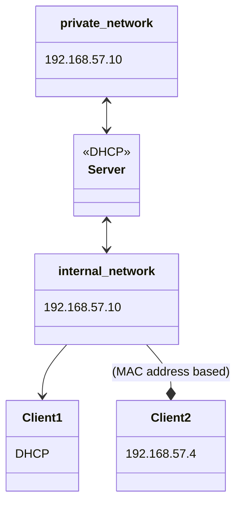

## DHCP SERVER

## Description

Deployment of a DHCP server with two clients, which are on an internal network and receive IP addresses from the DHCP server.

> The server will have two networls cards. The first card will be on the private solo-host network 192.168.56.0/24 and  the second card will be configured on an internal network 192.168.57.0/24

**Network structure:**

|     Machine    |       IP                       |
|----------------|--------------------------------|
| Server         |  192.168.57.10 - 192.168.56.10 |
| client 1       |              DHCP              |
| client 2       |   192.168.57.4 based on MAC    |

## Configuration

### Provisioning
The provisoning will be done using the scripts localted in `scripts/` directory. There will be a general provision, to update repositories and packages, and a specific one for the server, where we will install the dhcp service and deploy our server configuration files.

> [!WARNING]
> This repository is under development, some functions may not work.

