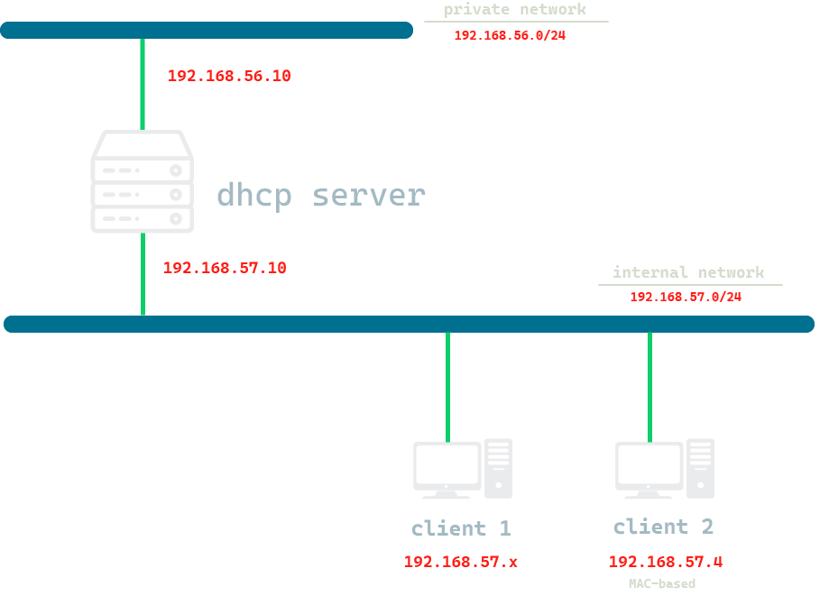
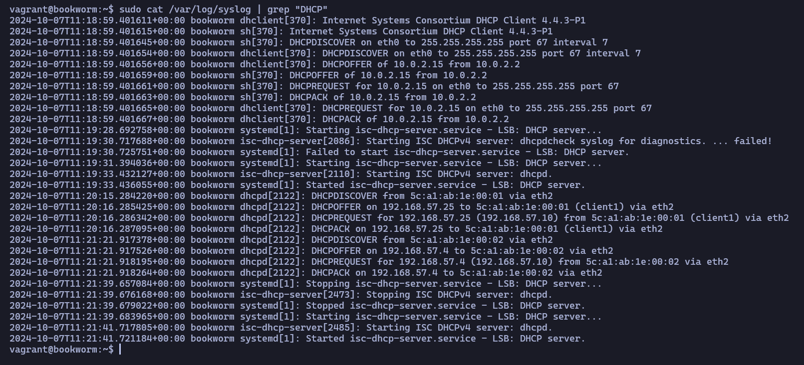
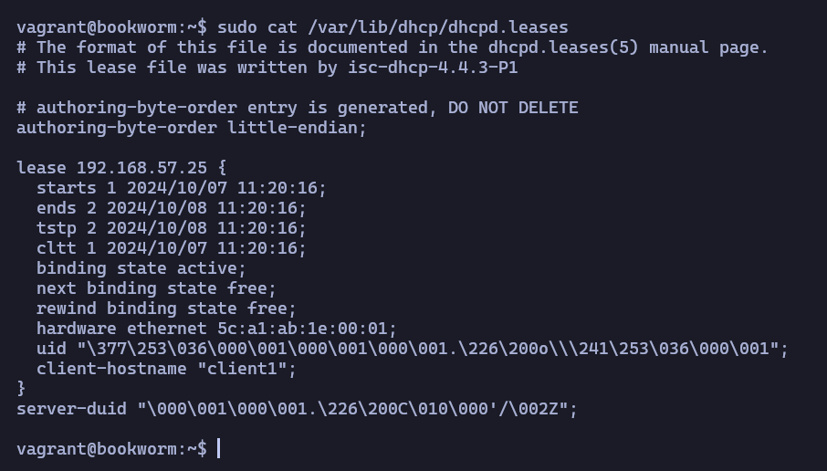
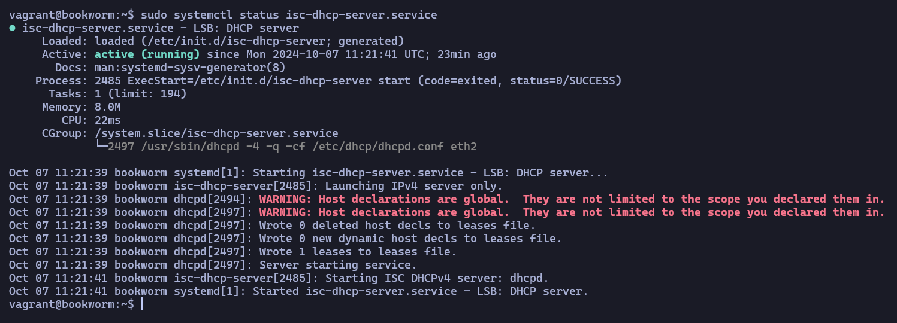

# DHCP SERVER

## :snowflake: Description

Deployment of a DHCP server with two clients, which are on an internal network and receive IP addresses from the DHCP server.

> The server will have two networks cards. The first card will be on the private solo-host network 192.168.56.0/24 and  the second card will be configured on an internal network 192.168.57.0/24

**Network structure:**

|     Machine    |       IP                       |
|----------------|--------------------------------|
| Server         |  192.168.57.10 - 192.168.56.10 |
| client 1       |              DHCP              |
| client 2       |   192.168.57.4 based on MAC    |


<br>

<div align="center">
    
</div>

## :snowflake: Configuration

### Provisioning
The provisoning will be done using the scripts localted in `scripts/` directory. There will be a general provision, to update repositories and packages, and a specific one for the server, where we will install the dhcp service and deploy our server configuration files.

### Directives
- DHCP Server:
    - The first card will be on the private host-only network 192.168.56.0/24 with IP 192.168.56.10. The second card will be configured on an internal network 192.168.57.0/24 with IP 192.168.57.10.
    - The first card will have an Internet connection so we can download the packages to configure the DHCP server.
    configure the DHCP server. The second one will be isolated from the rest of the equipment and we will be able to send the DHCP messages.
    DHCP protocol messages.
- Clients common directives:
    - The ip addresses will be assigned by the dhcp server.
    - They will be part of the internal network which is located at 192.168.57.0/24.
- Client 2 directives:
    - The DHCP server will always assign the ip address 192.168.57.4.
    - It will have a lease time of 1 hour
    - Client 2 DNS server will be 1.1.1.1.1.

## :wrench: Setup 
In this project we have the makefile file, which when executed will perform the relevant steps to perform the deploy for us.

- Using Makefile:
    ```bash
    make
    ```
- Without Makefile:
    ```bash
    vagrant up && vagrant provision
    ```

## :snowflake: Testing
- To check that our DHCP server is working properly we can check the messages exchanged by the DHCP server `/var/log/syslog`.

<div align="center">
    
</div>

- We can also check the list of grants that the server provides in `/var/lib/dhcp/dhcpd.leases`.

<div align="center">
    
</div>

- Another check we can perform is to check the status of the service with the command:
     
    ```bash
    sudo systemctl status isc-dhcp-server.service
    ```

<div align="center">
    
</div>


